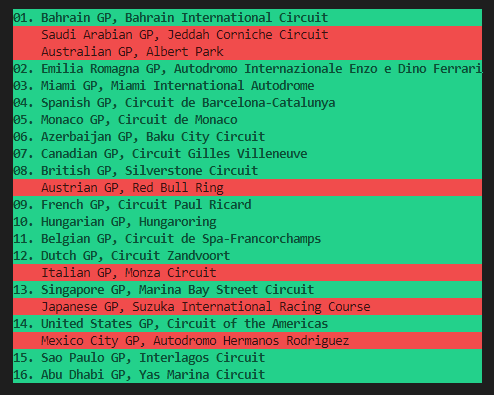

# F122 Game Grand Prix Race Calendar Generator

## Having a difficult time deciding which races to run in your F122 season? Use this to decide your next season calendar!

### Requirements:

`Python 2.x/3.x`

### Run:

Simply double click the bat file to run the generator. You can open the bat file in a text editor to change the settings.

| Settings        |                           Options                            | Default | Description                                                            |
| --------------- | :----------------------------------------------------------: | :-----: | ---------------------------------------------------------------------- |
| Calender Length | Short (10 races)   Medium (16 races)   Full (22 races) |  Full   | Length of the season                                                   |
| Season Number   |                            1 - 10                            |    1    | Current season in F122.   This will affect the Grand Prix available |
